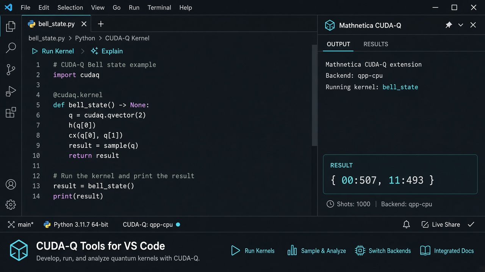

# Mathnetica Tools for CUDA-Q

<p align="center">
  
</p>

Independent developer tools for NVIDIA CUDA-Q™ in Visual Studio Code and Cursor.

Run CUDA-Q programs, inspect your environment, select execution targets, work with Jupyter notebooks, and optionally use AI assistance — without leaving the editor.



> **Preview:** Mathnetica Tools for CUDA-Q is under active development. Feedback and contributions are welcome.

## Features

- **Run CUDA-Q** — Execute CUDA-Q Python files directly from the editor
- **Kernel CodeLens** — Run `@cudaq.kernel` functions from the editor
- **Target selection** — Discover and switch between available CUDA-Q execution targets
- **Environment diagnostics** — Inspect Python, CUDA-Q version, platform, and GPU availability
- **CUDA-Q detection** — Automatically recognize CUDA-Q projects and files
- **Jupyter support** — Work with CUDA-Q inside VS Code / Cursor notebooks
- **CUDA-Q snippets** — Quickly create kernels, qvectors, sampling code, and common examples
- **Optional AI assistance** — Explain, fix, and generate CUDA-Q code using local Ollama or Mistral BYOK

## Quick Start

### 1. Install CUDA-Q

```bash
pip install cuda-quantum
```

Verify the installation:

```bash
python -c "import cudaq; print(cudaq.__version__)"
```

### 2. Select your Python environment

In VS Code or Cursor run:

```text
Python: Select Interpreter
```

Select the environment where CUDA-Q is installed.

### 3. Open CUDA-Q code

For example:

```python
import cudaq

@cudaq.kernel
def bell():
    qubits = cudaq.qvector(2)
    h(qubits[0])
    x.ctrl(qubits[0], qubits[1])

result = cudaq.sample(bell)
print(result)
```

The extension detects CUDA-Q and activates the relevant developer tools.

### 4. Run

Open the Command Palette (`Ctrl/Cmd + Shift + P`) and run:

```text
CUDA-Q: Run Current File
```

Output appears in the **Mathnetica Tools for CUDA-Q** output channel.

## Commands

| Command | Purpose |
|---|---|
| `CUDA-Q: Run Current File` | Run the active CUDA-Q Python file |
| `CUDA-Q: Run Kernel` | Run a detected CUDA-Q kernel |
| `CUDA-Q: Select Target` | Select an available execution target |
| `CUDA-Q: Show Environment` | Inspect the CUDA-Q development environment |
| `CUDA-Q: Open Documentation` | Open CUDA-Q documentation |

## Kernel CodeLens

CUDA-Q kernels are detected automatically:

```python
@cudaq.kernel
def bell():
    ...
```

Editor actions appear above the kernel:

```text
▶ Run Kernel    ✨ Explain
```

> In the current Preview, running a kernel executes the containing Python file so imports and surrounding context are preserved.

## Execution Targets

The current CUDA-Q target is shown in the status bar:

```text
CUDA-Q: qpp-cpu
```

Click the status bar item or run:

```text
CUDA-Q: Select Target
```

Target availability is determined from your local CUDA-Q environment. The extension does not assume that GPU or QPU targets are available.

## Jupyter Notebooks

CUDA-Q is supported in `.ipynb` notebooks opened with the Microsoft Jupyter extension.

Notebook-aware commands include:

- `Mathnetica: Explain Current Cell`
- `Mathnetica: Fix Current Cell`

Standalone JupyterLab is not currently supported.

## CUDA-Q Snippets

Type a prefix and press Tab:

```text
cudaq-import
cudaq-kernel
cudaq-qvector
cudaq-sample
cudaq-observe
cudaq-bell
```

## Optional AI Assistant

AI is completely optional. All core CUDA-Q tools work without configuring an AI provider.

### Ollama — Local

Configure:

```text
Mathnetica Tools for CUDA-Q › AI: Enabled → true
Mathnetica Tools for CUDA-Q › AI: Provider → ollama
```

Set the Ollama URL and model in settings. Requests go to your local Ollama instance.

### Mistral — BYOK

Run:

```text
Mathnetica: Set Mistral API Key
```

The key is stored in VS Code / Cursor SecretStorage — not in settings or source code.

When using a cloud provider, selected source code and relevant context may be sent to that provider.

## AI Commands

| Command | Description |
|---|---|
| `Explain Selection` | Explain selected CUDA-Q code |
| `Fix Selection` | Suggest a correction and show the proposed change |
| `Generate CUDA-Q Code` | Generate CUDA-Q code from a description |
| `Explain Current Cell` | Explain a CUDA-Q notebook cell |
| `Fix Current Cell` | Suggest corrections for a notebook cell |

AI-generated code may be incorrect. Review it before running.

## Requirements

- Visual Studio Code **1.85+** or Cursor
- Python 3.9+
- CUDA-Q installed in the selected Python environment

Recommended extensions:

- [Python](https://marketplace.visualstudio.com/items?itemName=ms-python.python)
- [Jupyter](https://marketplace.visualstudio.com/items?itemName=ms-toolsai.jupyter)

## Privacy

- No telemetry in the current Preview release
- Ollama: requests go to your configured local endpoint
- Mistral: request content is sent to Mistral's API
- API credentials use SecretStorage

## Known Limitations

This is an early Preview release.

- Kernel execution currently runs the containing Python file
- GPU detection depends on locally available system tooling
- Target discovery requires a working CUDA-Q installation
- Standalone JupyterLab is not supported
- Circuit visualization is not yet available
- AI does not yet use CUDA-Q documentation retrieval / RAG

## Roadmap

### v0.2 — Developer Experience

- Improved CUDA-Q diagnostics
- Better notebook integration
- CUDA-Q documentation context

### v0.3 — Visualization & Execution

- Circuit visualization
- Richer execution results
- Improved GPU execution workflow

### v0.4 — Migration

- Qiskit → CUDA-Q migration assistance

### v1.0

- Broader CUDA-Q development environment

The roadmap is directional and may change based on feedback.

## Feedback & Contributing

Bug reports, feature requests, and contributions are welcome via the [GitHub repository](https://github.com/Mathnetica/mathnetica-cudaq-vscode).

### Local development

```bash
npm install
npm run compile
```

Press `F5` to launch the Extension Development Host, or package a VSIX:

```bash
npm run package
```

Then install with **Extensions → Install from VSIX…**.

## License

MIT License. See [LICENSE](LICENSE) for details.

## Trademark Notice

Mathnetica Tools for CUDA-Q is an independent open-source project developed by Mathnetica. It is not affiliated with, sponsored by, or endorsed by NVIDIA Corporation.

NVIDIA and CUDA-Q are trademarks of NVIDIA Corporation in the United States and other countries. All other trademarks are the property of their respective owners.

This project does not use NVIDIA logos or official CUDA-Q branding assets.
